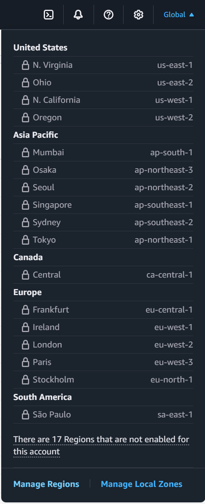
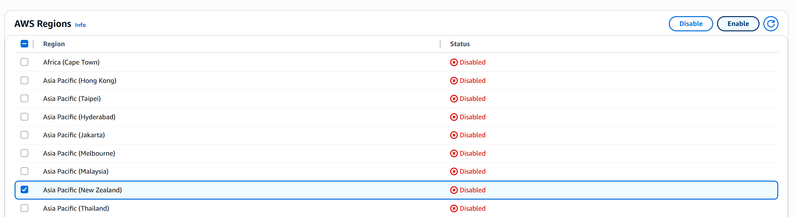
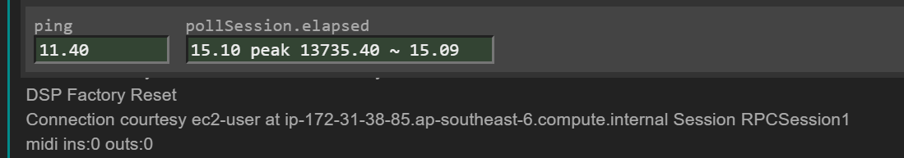
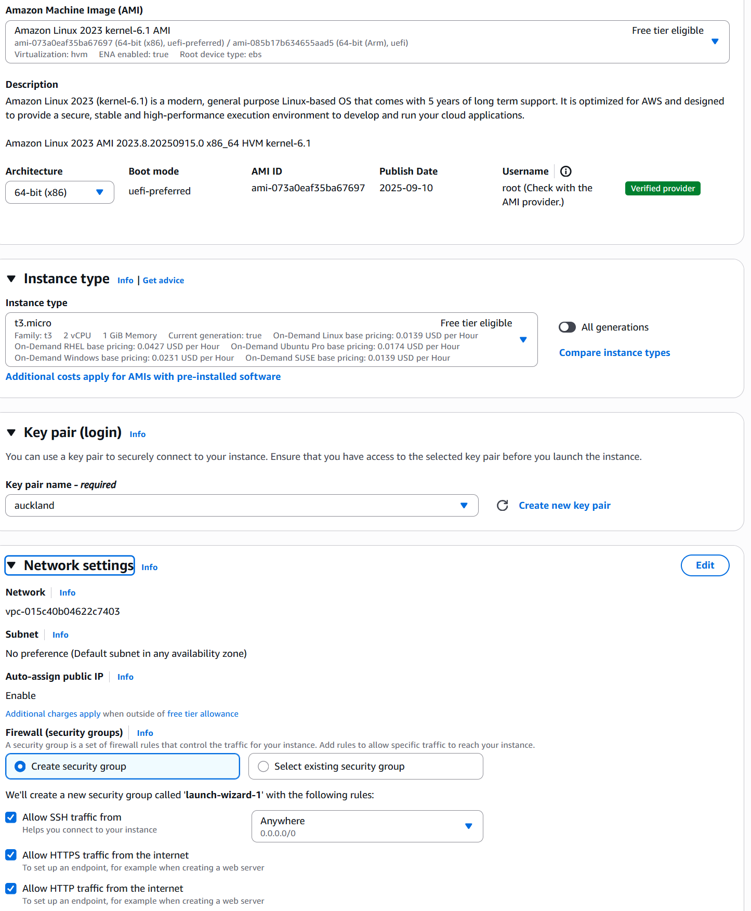
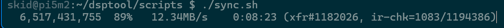
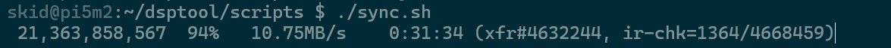

# nitrologic.github.io

A homebase for the nitrologic repositories

## Serendipity

> [kia ora AWS, welcome to New Zealand](https://aws.amazon.com/blogs/aws/now-open-aws-asia-pacific-new-zealand-region/) - Simon Armstrong

The new services are opt in so from the AWS console we find something to click



First click we select the Manage Regions



Second click, we locate New Zealand and voila, we Enable our new home.

https://ap-southeast-6.console.aws.amazon.com/ec2/home

### Step 1 Select a cheap t3.micro EC2 instance and boost the storage to 88GB NVME

So cheap, and as of September 2025 AWS is now a local resident. :celebrate:

No more hops across the Tasman for my synth vicious audio packets...



Will update later in October with actual pricing, the spec remains the same.



### Step 2 8GB SWAP

The following adds 8GB of swap to our 1GB t3.micro making Visual Studio remote sessions reliable on such a small footprint.

```
fallocate -l 8G /swapfile
chmod 600 /swapfile
mkswap /swapfile
swapon /swapfile
```

### Step 3 nginx and certbot shenanigans

Server side simon saliently slides silent style seventies sadd skills.

### Step 4 Sync grid5 geo tiles

```
rsync -az --info=progress2 /grid5 ec2-user@skid:/home/ec2-user/grid5/
```

The script must go on...




## Step 5 reset the nitrologic fit3 webserver

Our pet C++ web server fit3 jumps into service in search of bare metal pings.

```
sudo hostname -b skid
sudo systemctl start redis6
sudo service nginx start
pushd dsptool/native/bin
./fit3
#gdb -ex "set print thread-events off" -ex=run ./fit3
popd
```

## Step 6 document the DSPHost stack

Will hide the Synth Vicious project aside in order to showcase recent LLM research.

Service now intermittent at https://skid.nz


## Previously

* Fountain now responds with slop.

* bibli now has more interesting bits

* AWS EC2 instance is back sydney.nz t3.micro

Older ramblings [?2025Q3.md]
