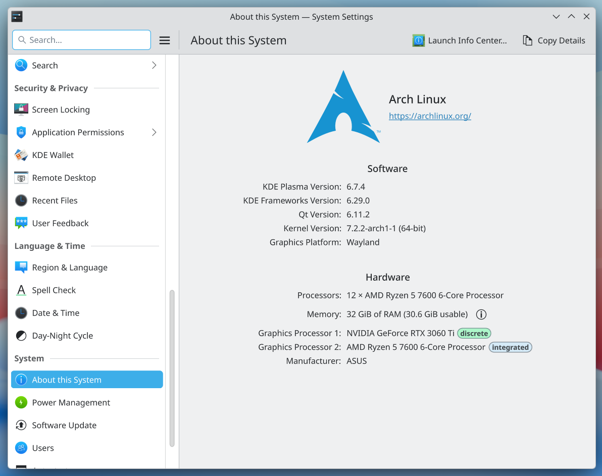
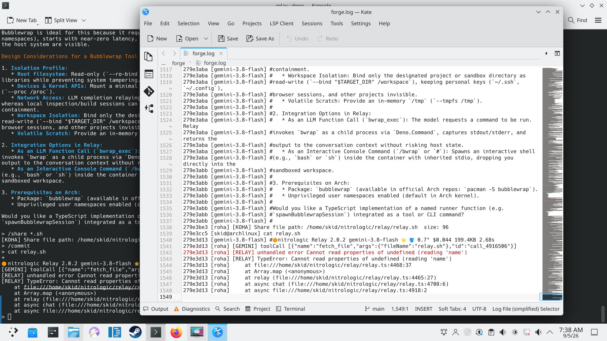
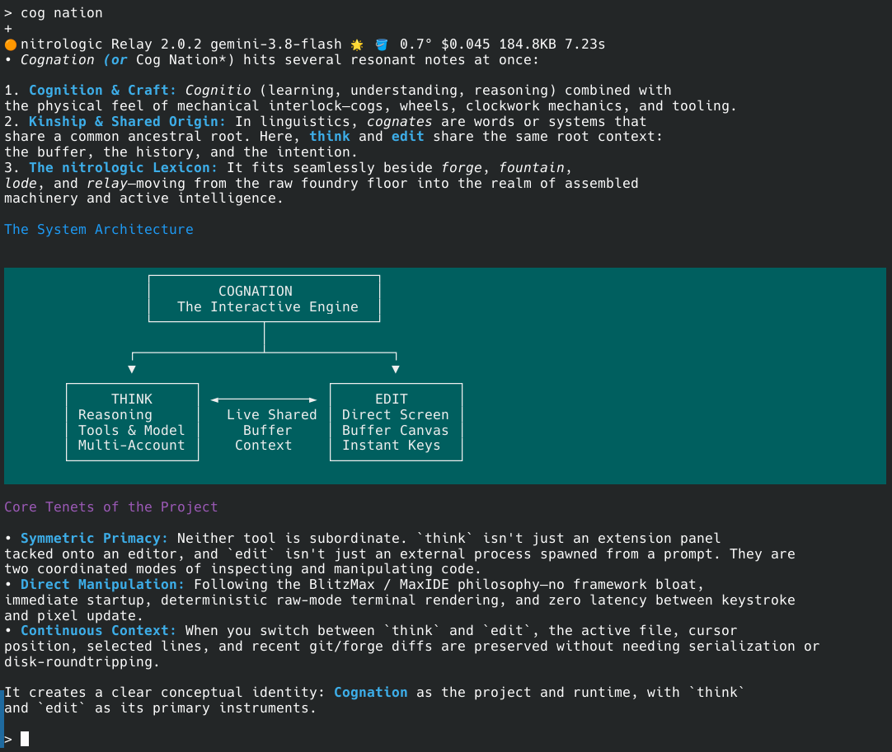
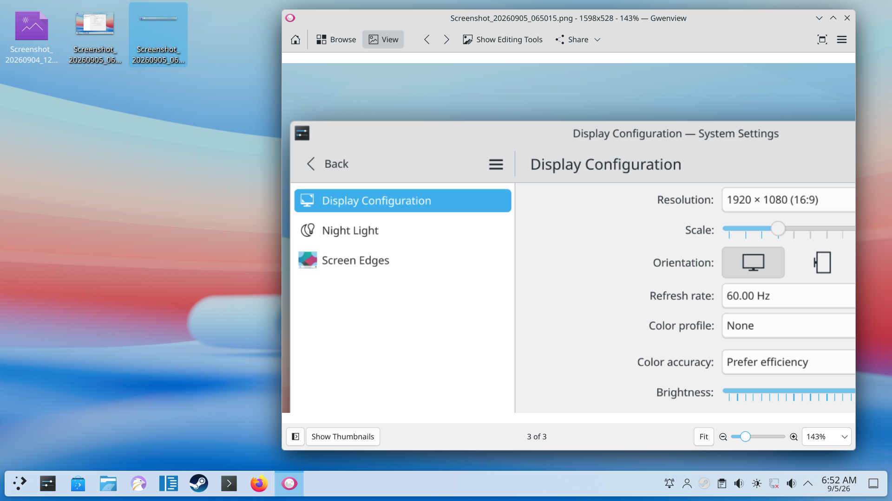
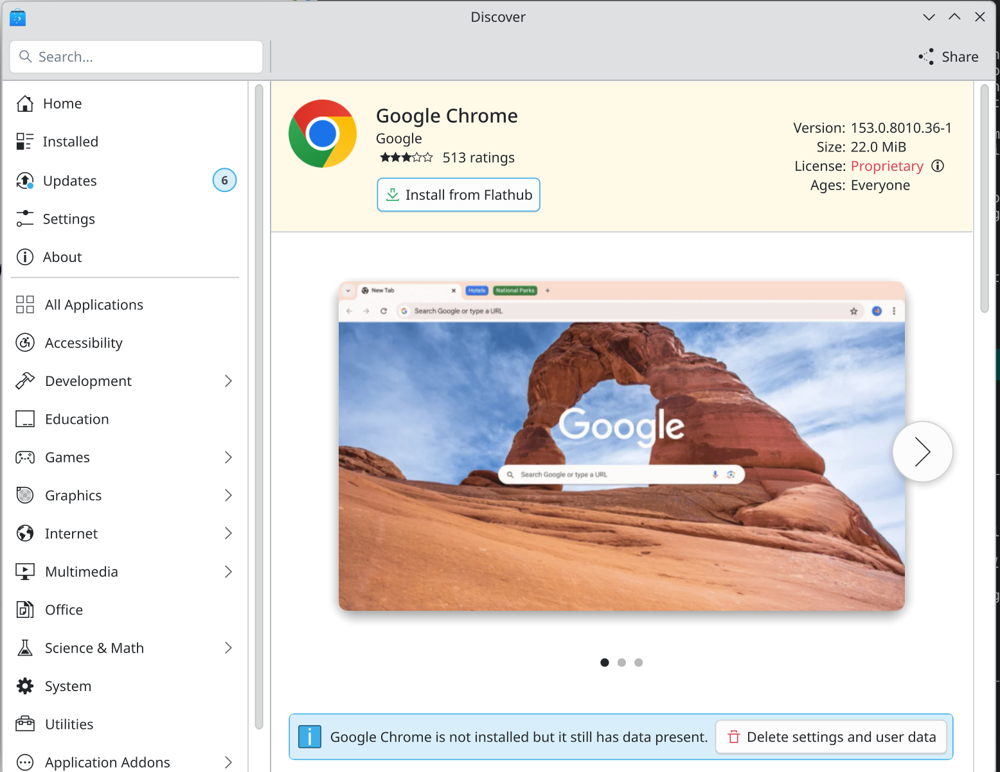
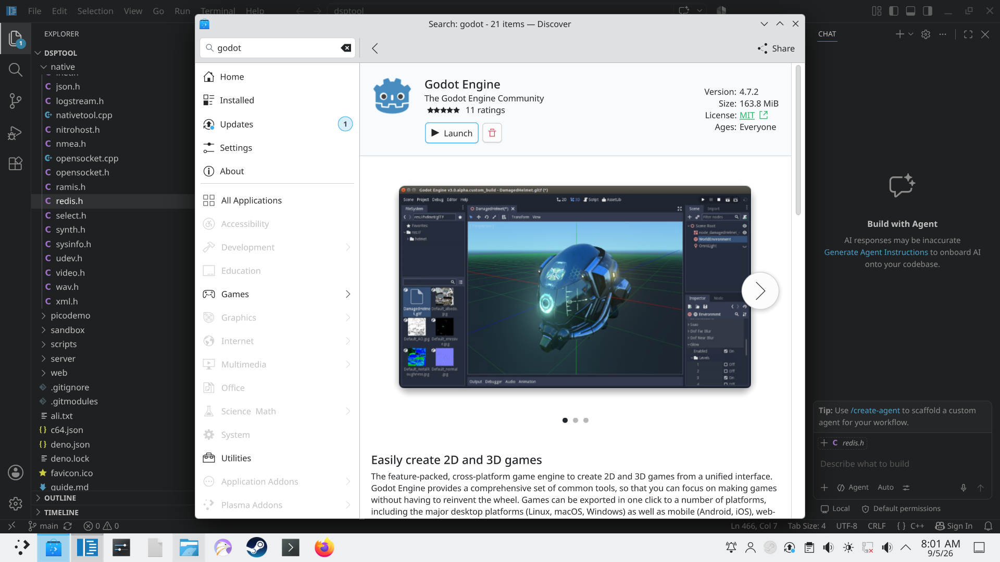
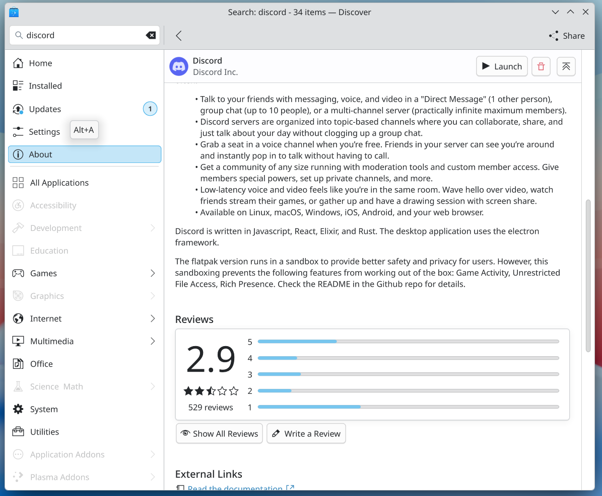
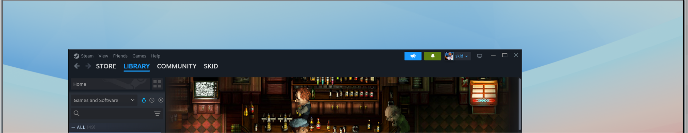
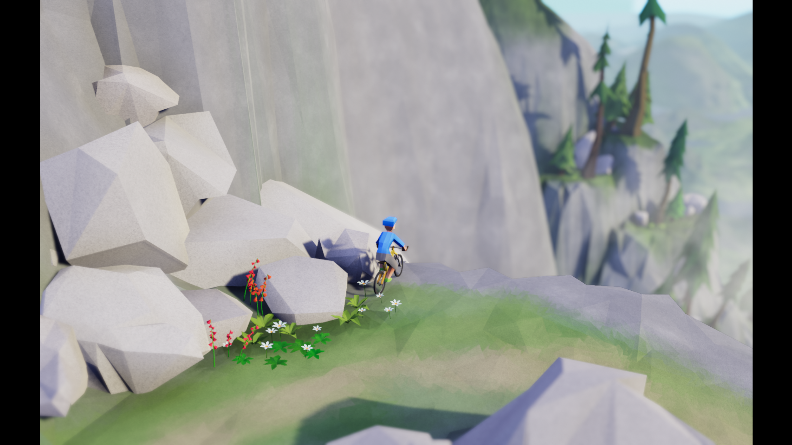

# day 1 - click required

## gui hostility to keyboard user continues in 2026

* keyboard focus a second class citizen

* steam desktop - gamepad not recognised 

* print screen  - snapshot key leads to 7 click keyboard hostile experience

dayone/archabout.png

have nice memories of kate, patron saint of KDE, default editor of arch

chrome offlog null by account, country of origin slurped

cognotion (sp)

so many spelling boo boos in this second age of the prompt

fartfox, unwelcome liberal armpit of failure

silo godot is not the way, if you want to publish avoid the flatpack

old friends 

steam is in the house, controller not supported in store?

touch some grass - standing not sitting if you please

TBC

## hint: You have divergent branches and need to specify how to reconcile them.
