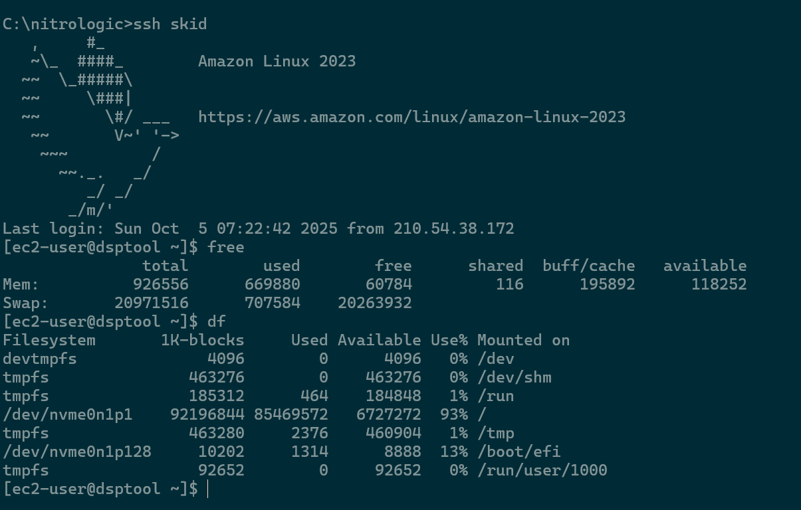

# DSP Tool

A media lab software stack for macro managers.

## Hosting 

Serving from a local AWS EC2 instance is a reality in AK2025.

> [KIA ORA AWS! Welcome to Asia Pacific region 6](https://aws.amazon.com/blogs/aws/now-open-aws-asia-pacific-new-zealand-region/) - Simon Armstrong

Yes that is a lot of swap. 

A parked side project will explain [later](https://github.com/nitrologic/roagrid).

## Overview

In current configuration this project features the fit3 c++ web service and a large stack of client modules under the nitrojs name.

Various modules of questionable status include:

* meter
* log
* host
* wire
* keys
* synth
* wiki
* grid

### synth

This is third iteration of a personal noise generator,  based on synth vicious inside [skid monkey2 m2](https://github.com/nitrologic/m2) project.

### grid

Image data courtesy Land Information New Zealand

https://data.linz.govt.nz/

LICENSE: Creative Commons Attribution 4.0 International

https://data.linz.govt.nz/license/attribution-4-0-international/

