```
nitrologic.github.io/index.md
(c)2026 nitrologic
all rights reserved
```

## ben eater


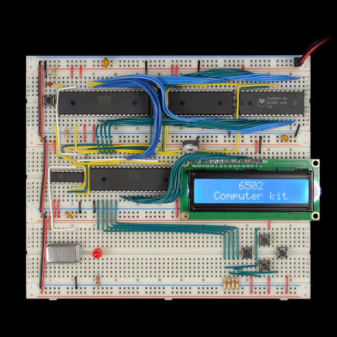

https://eater.net/6502

Hurrah, the machine project now has it's own assembler - burn more ROM

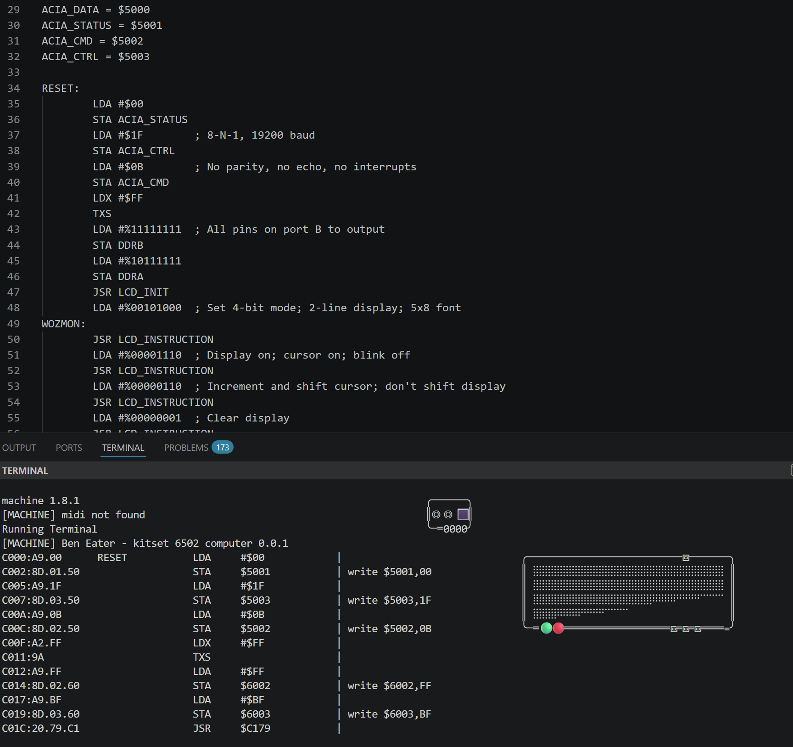


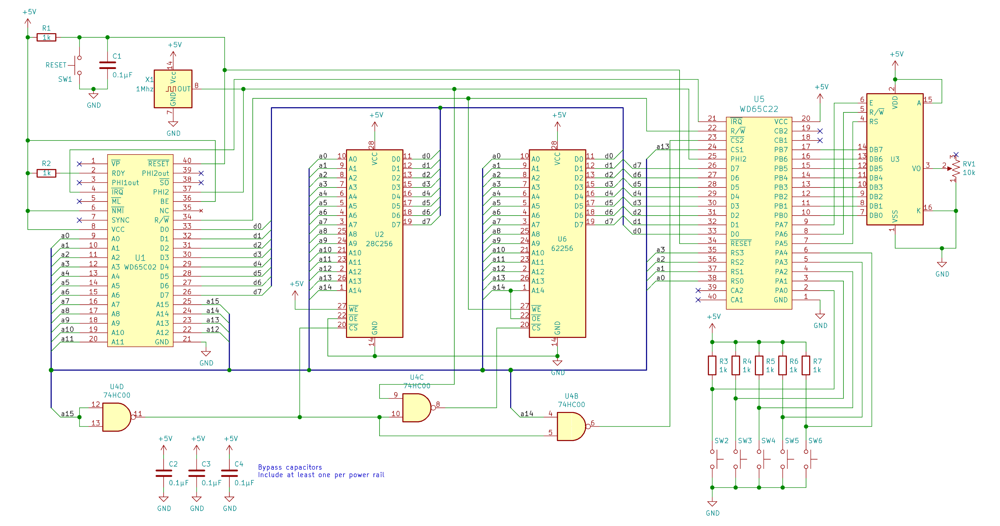


## loading Little Brickout

alterntaive method from program entry using paste and run

the load command reads from cassette 

cassette came from the shop, or your mates

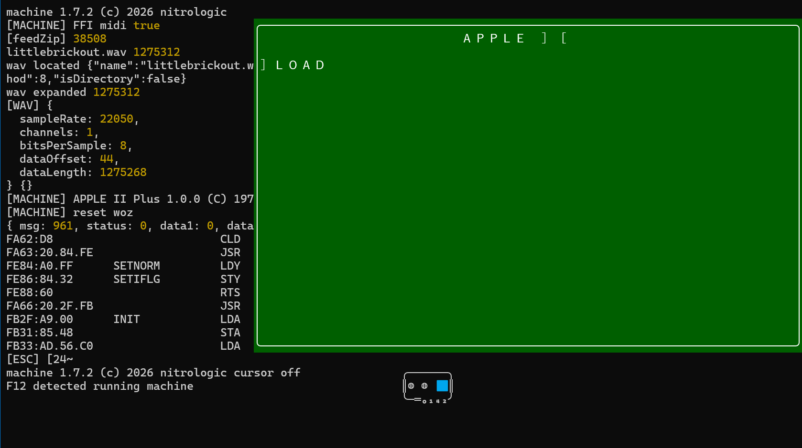

tape counter gets to 1407? umm ok

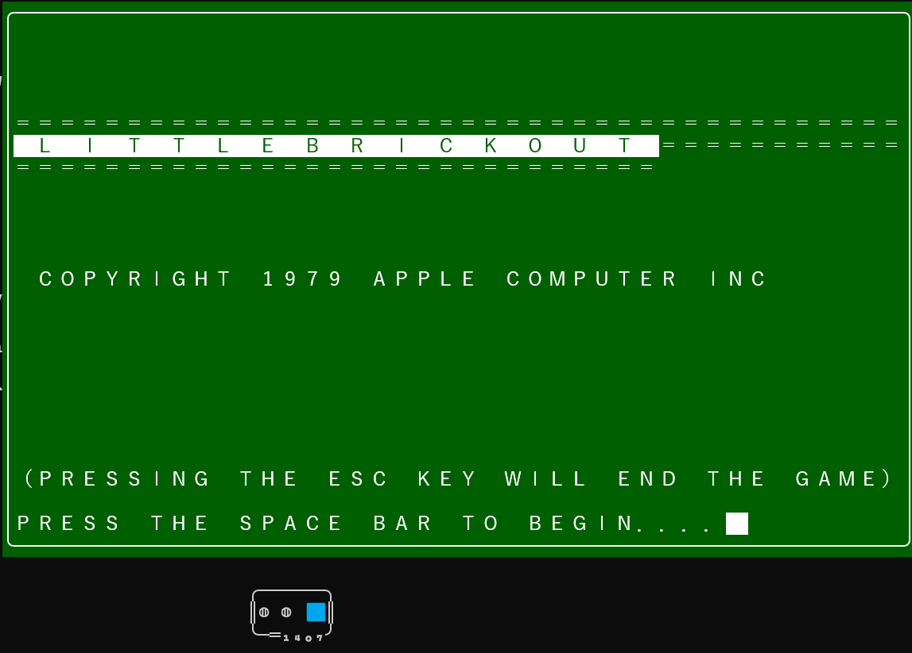


## 1541 blinking leds

Processor diagnostics with precursor, action and status columns.

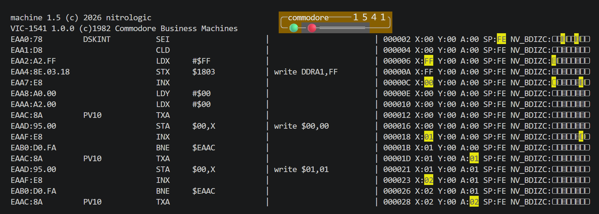

# VIC20 with json hand label diversions

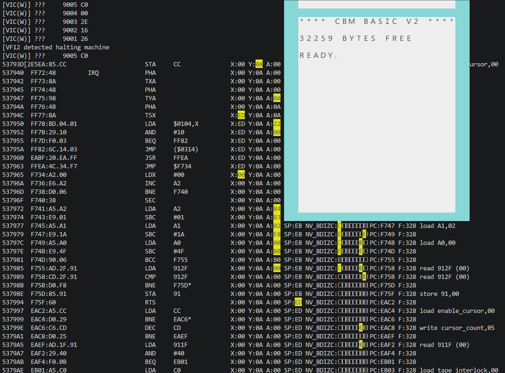

# 1541 drive stepping

The 1541 disk drive has it's own 6502 CPU and is running virtual in my terminal.


We single step throught the first instructions, let it run for a bit, 

25B4A7 cycles later...

and it returns!

Blinking lights incoming.

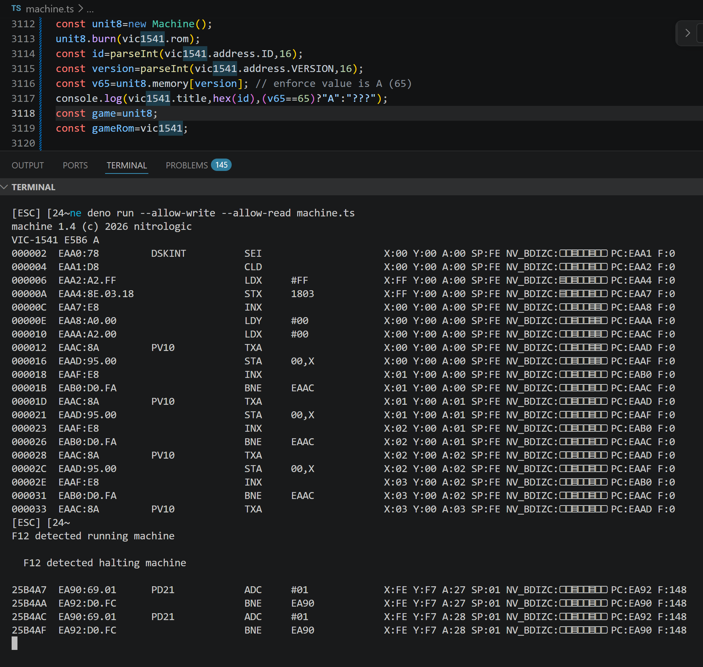


# an appleII in my terminal

Winter 2026 and current appleII emulation development ticks all the boxes in nostalgia section.

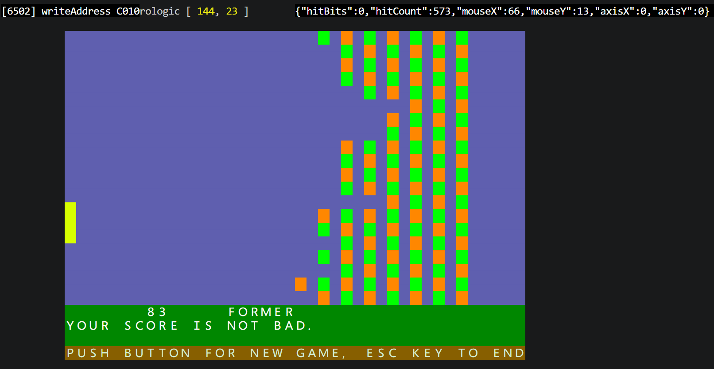

I have the terminal mouse mapped to appleII paddle timer, initial findings, woz's brickout is difficult.

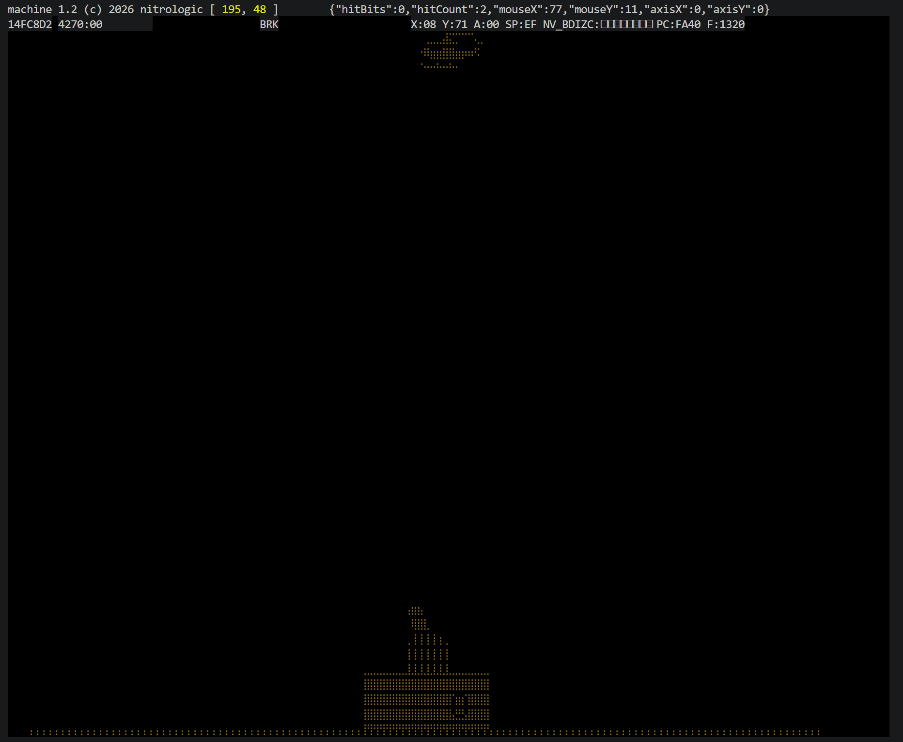

Sabotage is in the I cannot wait to see the little guys come raining down. Early days...

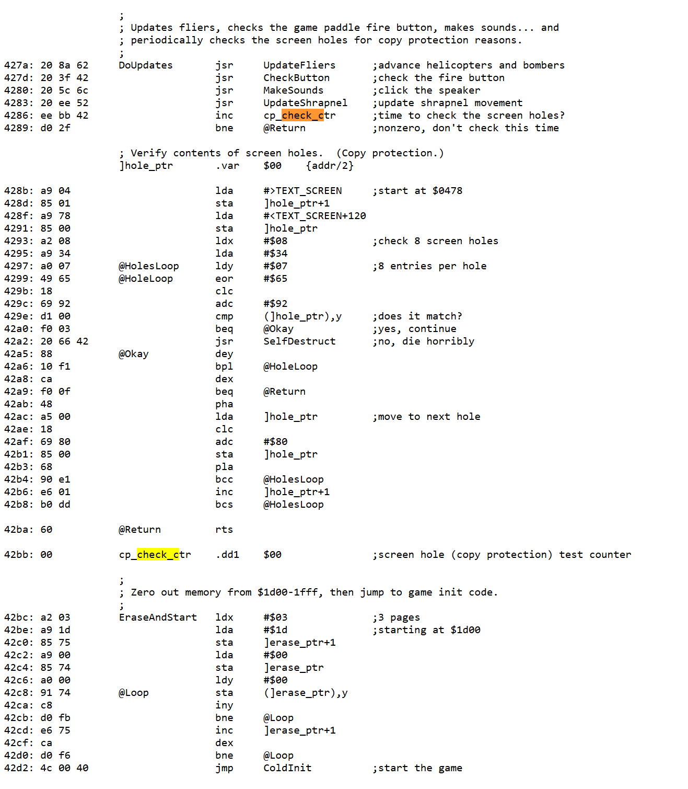

Educational value of this technique worth a case study.

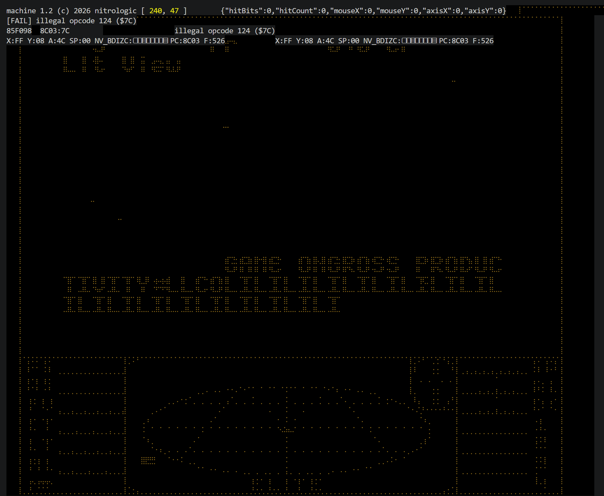

Only 4 new opcodes added to get this far, too cool for school.


# nitrologic index

* [biblispec testbed](https://nitrologic.github.io/biblispec/maze/vanilla.html)
* [nitrologic profile](https://github.com/nitrologic)
