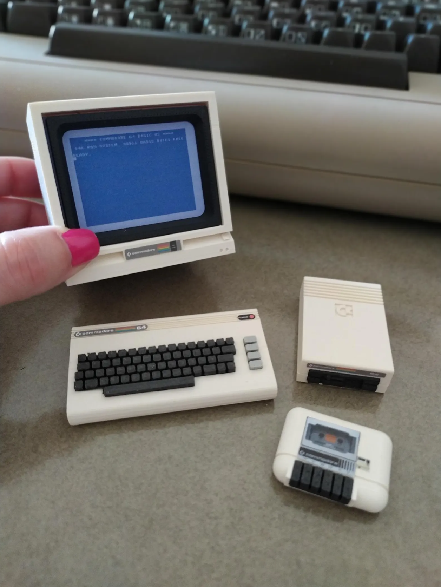

# vintage kid

name: studio vibes and feels

location: Auckland, New Zealand

host: AWS://ap-southeast-6

home: [https://skid.nz](https://skid.nz)

## 1:6 Scale C= RP2040 designs

 

### luma2
C64 composite video capture via LM319 comparators.
2-bit greyscale, 320x200 @ 50Hz. Optional chroma/audio mods.

### joy
Read and drive multiple joystick connections.

### fifteen
Triple network bridge: C64 IEC serial, GBA link, Megadrive EXT.
Point-to-point wiring, no PCB required.

### waffle
GBA cartridge interface. 32-pin, 3.3V native.
Direct GPIO connection, simplest PCB.

### node
C64 user port interface. 24-pin edge connector.
8-bit parallel + serial via shift registers.

### toast
C64 expansion port interface. 44-pin edge connector.
Full bus access via shift registers and FETs.

### crumpet
Megadrive cartridge interface. 64-pin edge connector.
16-bit bus via shift registers and latches.

>

# Parts On Order

## Waveshare 

Waveshare 2" IPS 320x240 SPI
40.8mm x 35mm
ST7789T3
https://www.waveshare.com/Pico-LCD-2.htm
US$12.99

Waveshare 2.8" Capacitive Touch IPS 320×240 SPI
70.20mm x 52.20mm
ST7789T3
https://www.waveshare.com/Pico-ResTouch-LCD-2.8.htm
US$14.99

Waveshare 1.14" IPS 240×135 SPI
1.14" LCD Module,IPS,65K colorful,240×135,
35mm × 32mm
ST7789,
https://www.waveshare.com/1.14inch-lcd-module.htm
$7.99

## Element14

* LUMBERG,DIN Audio / Video Connector, 6 Contacts, Jack, Chassis Mount, Through Hole Right Angle,2677786,0105 06,$5.81,2,$11.62
* EDAC,Card Edge Connector, Dual Side, 1.57 mm, 44 Contacts, Through Hole Mount, Straight,1704322,307-044-520-202,$21.20,1,$21.20
* EDAC,CARD EDGE CONN, DUAL SIDE, 24POS, TH,3807078,305-024-520-202,$15.40,1,$15.40
* MULTICOMP,D Sub Connector, DB9, Standard, Plug, PCB, 9 Contacts, DE, Solder,2668383,DE09-PA-M2,$3.01,5,$15.05

## Jaycar 

* 8,10K ohm Piher Horizontal Trimpot,1.65,13.20,RT43608
* 1,74LVC245 Channel Bus Transceiver DIP20,11.20,11.20,ZK88842
* 4,74HC165 8-bit parallel in/out Shift Register IC,4.20,16.80,ZC48588
* 10,10k Ohm 0.5 Watt Metal Film Resistors - Pack of 8,1.00,10.00,RR059610
* 24,2N7000 N-Channel FET,0.405,9.72,ZT240012
* 2,74LS374 Octal Tri D Flip Flop IC,6.00,12.00,ZS52744
* 4,LM319 High Speed Dual Comparator Linear IC,4.50,18.00,ZL33194
* 1,4046 Phase Lock Loop CMOS IC,4.60,4.60,ZC40462
* 2,20k Ohm 0.5 Watt Metal Film Resistors - Pack of 8,1.00,2.00,RR06032
* 1,2.2k Ohm 0.5 Watt Metal Film Resistors - Pack of 8,2.00,2.00,RR05802
* 1,3.3k Ohm 0.5 Watt Metal Film Resistors - Pack of 8,2.00,2.00,RR05842
* 1,4.7k Ohm 0.5 Watt Metal Film Resistors - Pack of 8,1.00,1.00,RR0588
* 1,220k Ohm 0.5 Watt Metal Film Resistors - Pack of 8,1.00,1.00,RR0628
* 1,75 Ohm 0.5 Watt Metal Film Resistors - Pack of 8,2.00,2.00,RR05452
* 1,100pF 50VDC Ceramic Capacitors - Pack of 2,0.50,0.50,RC53241
* 15,100nF 50VDC Ceramic Capacitors - Pack of 2,9.75,146.25,RC536015
* 1,10uF 25VDC Electrolytic RB Capacitor,0.88,0.88,RE60702
* 1,PC Mount RCA Socket,8.40,8.40,PS02794
* 2,4051 Single 8-channel Analogue Multiplexer CMOS IC,2.10,4.20,ZC40512
* 1,330 Ohm 0.5 Watt Metal Film Resistors - Pack of 8,2.00,2.00,RR05602
* 1,DB9 Female Connector - Solder,2.30,2.30,PS08041
* 1,DB9 Male Connector - Solder,7.00,7.00,PP08004
* 1,10 Pin IDC Right Angle Header,3.80,3.80,PP11184
